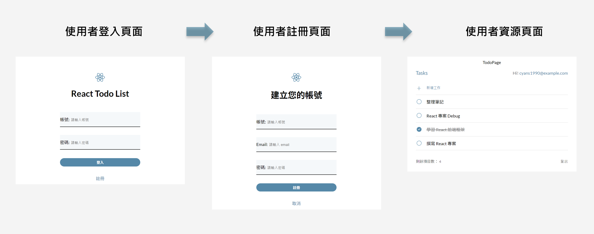

# React Todo List 專案

## 介紹
+ 使用者可以查看自己的所有 todo
+ 使用者可以新增 todo
+ 使用者可以刪除 todo
+ 使用者可以標記完成/未完成的 todo
+ 使用者可以雙擊清單上的特定 todo 編輯內容
+ 使用者可以註冊 / 登入 / 登出

## 重點技術
+ 用 React 實作 UI 切版
+ 使用 state 產生動態的頁面
+ 透過 props 傳遞資料與事件處理
+ 使用 react-router-dom 建立網頁路由架構, 實現多頁面導航 
+ 進行前端 CRUD 基礎資料操作
+ 串接後端 API 服務 (含 token 身份驗證)
+ 應用 React Hook: useEffect, useRef

## 依賴套件
### dependencies
+ @testing-library/jest-dom: 5.16.5
+ @testing-library/react: 13.4.0
+ @testing-library/user-event: 13.5.0
+ axios: 0.27.2
+ clsx: 1.2.1
+ dotenv: 16.4.5
+ gh-pages: 4.0.0
+ json-server: 0.17.0
+ jsonwebtoken: 8.5.1
+ jwt-decode: 4.0.0
+ react: 18.2.0
+ react-dom: 18.2.0
+ react-router-dom: 6.4.1
+ react-scripts: 4.0.3
+ sass: 1.56.2
+ styled-components: 5.3.5
+ sweetalert2: 11.6.4
+ web-vitals: 2.1.4

### devDependencies
+ @types/react: 18.3.3
+ @types/react-dom: 18.3.0
+ @vitejs/plugin-react: 4.3.1
+ eslint: 8.57.0
+ eslint-plugin-react: 7.34.3
+ eslint-plugin-react-hooks: 4.6.2
+ eslint-plugin-react-refresh: 0.4.7
+ vite: 5.3.4
+ vite-plugin-svgr: 4.2.0

## 使用 Vite
此專案的 React 是使用 [Vite](https://vitejs.dev/) 搭建的現代前端開發工具。Vite 提供了快速的 HMR 更新和更短的構建時間, 使開發過程更高效。使用 Vite 作為專案的構建工具, 可享受以下優勢:

+ **快速啟動**：Vite 使用原生 ES 模組, 使得啟動時間非常迅速
+ **即時更新**：支持 HMR, 即時反映代碼變更, 提升開發效率
+ **高效構建**：利用 Vite 的構建工具, 快速生成優化的生產版本

## GitHub Actions 自動化
此專案中使用了 GitHub Actions 來實現 CI/CD（持續集成和持續部署）流程。以下是一些自動化處理的技術介紹:

+ **自動測試**：每次提交代碼時, 自動運行測試來確保代碼的正確性
+ **自動部署**：在代碼通過測試後, 自動將最新版本部署到伺服器或靜態網站託管服務（如 GitHub Pages）
+ **工作流程文件**：在 `.github/workflows` 目錄下定義工作流程文件（例如 `deploy.yml`）, 來配置自動化任務

這個工作流程在每次推送到指定分支分支時會執行（例如 `main`）, 完成以下步驟:
1. 拉取代碼
2. 安裝依賴套件
3. 構建專案
4. 將構建後的文件部署到 GitHub Pages

通過這些自動化處理, 提高專案開發效率和程式碼品質。

